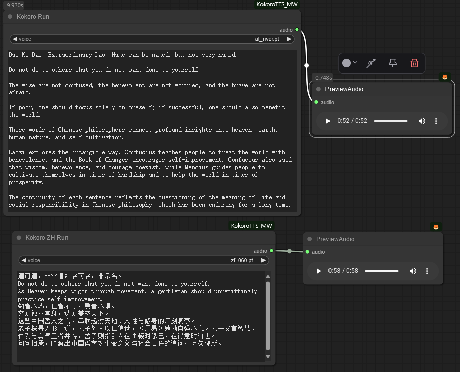

[中文](README_MAC.md) | [English](README-EN.md) 

# Kokoro TextToSpeech Node for ComfyUI (Mac Optimized)



This is a Mac-optimized version of the KokoroTTS node with added support for Metal Performance Shaders (MPS) acceleration on Apple Silicon (M-series) chips.

## 📣 Updates

[2025-05-10] ⚒️: Added MPS optimization support for Apple Silicon, improving efficiency on Mac devices.

[2025-03-22] ⚒️: Refactored code, faster generation speed.

[2025-03-05]⚒️: Supports 8 languages and 150 voices.

- New language support added:

'e' => Spanish  
'f' => French  
'h' => Hindi   
'i' => Italian   
'p' => Brazilian Portuguese   

- Corresponding newly added voices:

"e": ["ef_dora.pt", "em_alex.pt", "em_santa.pt"]

"f": ["ff_siwis.pt"]

"h": ["hf_alpha.pt", "hf_beta.pt", "hm_omega.pt", "hm_psi.pt"]

"i": ["if_sara.pt", "im_nicola.pt"]

"p": ["pf_dora.pt", "pm_alex.pt", "pm_santa.pt"]

- Added 100 new Chinese voices

## Installation

```
cd ComfyUI/custom_nodes
git clone https://github.com/yourusername/COMFYUI_KOKOROTTS_MW_for_mac.git
cd COMFYUI_KOKOROTTS_MW_for_mac
pip install -r requirements.txt
```

## Models Download

- The models and voices need to be manually downloaded and placed in the `ComfyUI\models\Kokorotts` path.

[Kokoro-82M](https://huggingface.co/hexgrad/Kokoro-82M)  
[Kokoro-82M-v1.1-zh](https://huggingface.co/hexgrad/Kokoro-82M-v1.1-zh)

The structure is as follows:
```
ComfyUI\models\Kokorotts
│ Kokoro-82M
   └── voices
   config.json
   kokoro-v1_0.pth
| Kokoro-82M-v1.1-zh
   └── voices
   config.json
   kokoro-v1_1-zh.pth
```

## Mac Optimization Features

- Added support for Metal Performance Shaders (MPS) on Apple Silicon (M-series) chips
- Automatic device detection: prioritizes CUDA > MPS > CPU
- Safe tensor and model device conversion handling
- Memory management optimization with MPS device cache clearing support

## Features

- High-quality text-to-speech synthesis
- Multiple voice options
- Support for multilingual text
- Easy integration with ComfyUI workflows

## Supported Languages

'a' => American English 
'b' => British English 
'e' => Spanish
'f' => French
'h' => Hindi
'i' => Italian
'j' => Japanese 
'p' => Brazilian Portuguese
'z' => Chinese 

### Acknowledgement

- [Kokoro](https://github.com/hexgrad/kokoro)
- Original project: [ComfyUI_KokoroTTS_MW](https://github.com/billwuhao/ComfyUI_KokoroTTS_MW) 