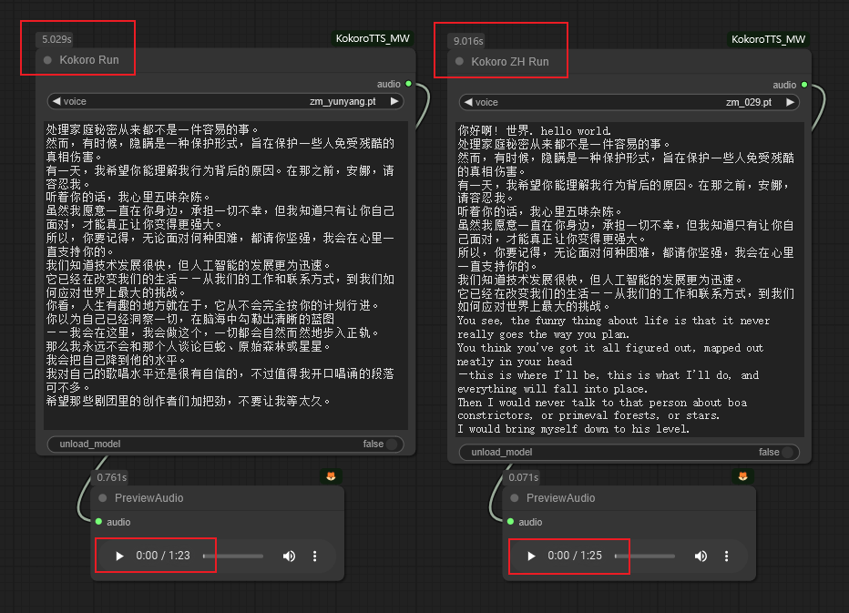

[中文](README-CN.md) | [English](README_MAC.md) 

# Kokoro TextToSpeech Node for ComfyUI (Mac Optimized)



这是KokoroTTS节点的Mac优化版本，添加了对Apple Silicon (M系列)芯片的MPS加速支持。

## 📣 更新

[2025-05-10] ⚒️: 添加了对Apple Silicon的MPS优化支持，提升Mac设备的运行效率。

[2025-03-22] ⚒️: 重构代码，提高生成速度。

[2025-03-05]⚒️: 支持8种语言和150个声音。

- 新增语言支持: 

'e' => 西班牙语  
'f' => 法语  
'h' => 印地语  
'i' => 意大利语  
'p' => 巴西葡萄牙语  

- 相应新增的声音: 

"e": ["ef_dora.pt", "em_alex.pt", "em_santa.pt"]

"f": ["ff_siwis.pt"]

"h": ["hf_alpha.pt", "hf_beta.pt", "hm_omega.pt", "hm_psi.pt"]

"i": ["if_sara.pt", "im_nicola.pt"]

"p": ["pf_dora.pt", "pm_alex.pt", "pm_santa.pt"]

- 添加100个新的中文声音

## 安装

```
cd ComfyUI/custom_nodes
git clone https://github.com/你的用户名/COMFYUI_KOKOROTTS_MW_for_mac.git
cd COMFYUI_KOKOROTTS_MW_for_mac
pip install -r requirements.txt
```

## 模型下载

- 模型和声音文件需要手动下载并放置在 `ComfyUI\models\Kokorotts` 路径下。

[Kokoro-82M](https://huggingface.co/hexgrad/Kokoro-82M)  
[Kokoro-82M-v1.1-zh](https://huggingface.co/hexgrad/Kokoro-82M-v1.1-zh)

结构如下:
```
ComfyUI\models\Kokorotts
│ Kokoro-82M
   └── voices
   config.json
   kokoro-v1_0.pth
| Kokoro-82M-v1.1-zh
   └── voices
   config.json
   kokoro-v1_1-zh.pth
```

## Mac优化特性

- 添加了对Apple Silicon (M系列)芯片的Metal Performance Shaders (MPS)支持
- 设备自动检测功能：优先使用CUDA > MPS > CPU
- 安全的张量和模型设备转换处理
- 内存管理优化，支持MPS设备的缓存清理

## 功能特点

- 高质量文本到语音合成
- 多种声音选项
- 支持多语言文本
- 易于与ComfyUI工作流集成

## 支持的语言

'a' => 美式英语 
'b' => 英式英语 
'e' => 西班牙语
'f' => 法语
'h' => 印地语
'i' => 意大利语
'j' => 日语 
'p' => 巴西葡萄牙语
'z' => 中文 

### 致谢

- [Kokoro](https://github.com/hexgrad/kokoro)
- 原始项目：[ComfyUI_KokoroTTS_MW](https://github.com/billwuhao/ComfyUI_KokoroTTS_MW) 